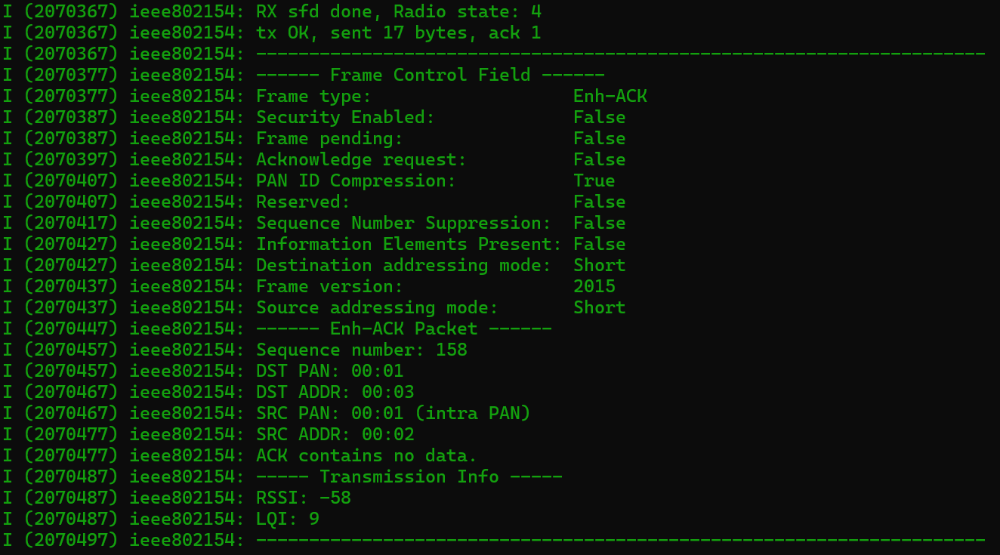
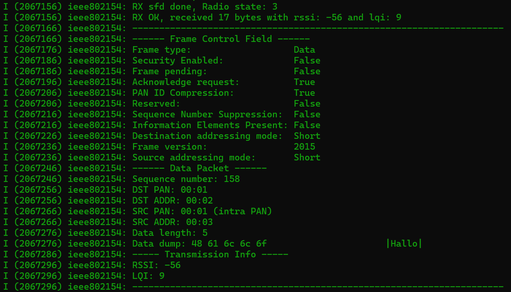

# esp-idf-ieee802154-utility

This repository contains two projects for ESP-IDF and IEEE802.15.4.

The project **"ieee802154-tx"** is a test application that sends IEEE802.15.4 frames at regular intervals. The project **"ieee802154-rx"** receives the frames and prints them in a rich format to the console.

Both projects use a utility library that provides functions to create IEEE802.15.4 headers and frames. Moreover, the library also provides functions to create Enh-ACKs according to the IEEE802.15.4-2015 standard.

The functionality has been tested on ESP32-C6 boards.

## Feature Summary

- Create and send IEEE802.15.4-2003 data headers/frames
- Create and send IEEE802.15.4-2015 data headers/frames
- Create IEEE802.15.4-2015 Enh-ACK frames from received frames
- Rich debug print of received packets

## Future Features

In the future, I plan to support the following features:

- Support for MAC command and beacon frames
- Support for a PAN Coordinator

## Rich Console Output

Sender

Receiver
